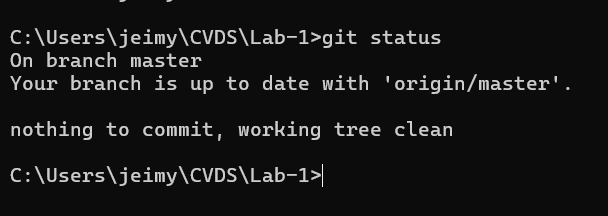
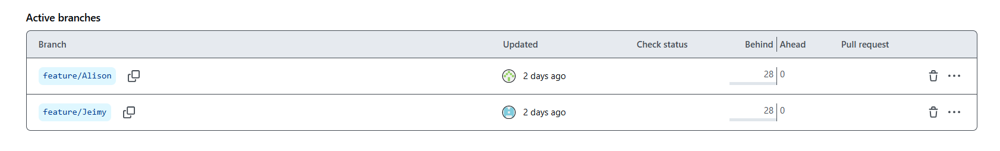
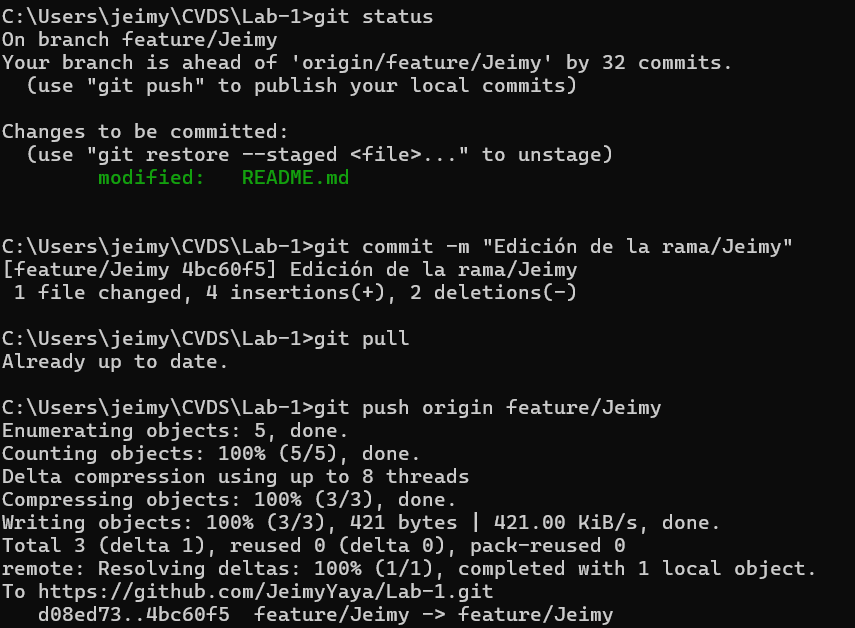
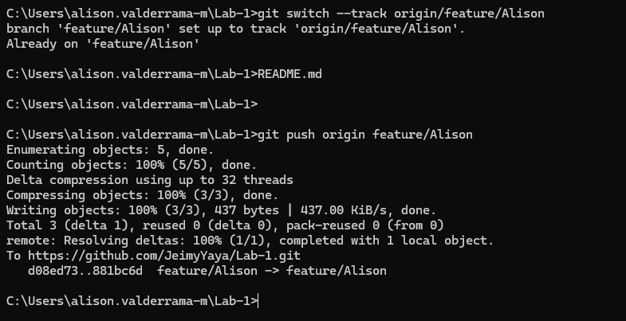

# LABORATORIO 1 CVDS 2025
Primer Laboratorio de CVDS   
Conocimientos de git y comandos básicos para buen manejo y aprovechamiento de trabajo en equipo.   
Se desarrollara el primer laboratorio con los siguientes integrantes:
   
## Integrantes
- Alison Valderrama
- Jeimy Yaya
# RESPUESTAS
## Parte I
El comando **git add** se usa para mover cambios desde el directorio de trabajo al área de preparación.   
El comando **git commit** guarda los cambios en el área de preparación en el repositorio local con un mensaje descriptivo.

 
   
## Parte II
Solución De Conflictos  
- **Owner**: Jeimy Yaya    
- **Collaborator**: Alison Valderrama
   
Cuando se edita y se suben al mismo tiempo los cambios al **Collaborator** le sale el siguiente error:
   
.png)

Esto significa que el **Owner** subió una versión del proyecto que el **Collaborator** no posee, ahora el **Collaborador** debe tomar esa versión del proyecto y corregir los problemas de las diferentes versiones(la de él y la del **Owner**)

.png)

Usando IntelliJ para resolver el conflicto, aparecera una interfaz que nos muestra el error y la opción para unir las dos versiones existentes.

.png)

.png)

Esto nos permite elegir que versión queremos y finalmente realizar el commit con los cambios.

## Parte III
**¿Hay una mejor forma de trabajar con git para no tener conflictos?**
   
- Una opción es trabajar con ramas asi cada desarrollador puede trabajar en una rama específica en lugar de modificar directamente la rama principa, al finalizar puede fusionarlo con la rama principal.
     
**¿Qué es y como funciona el Pull Request?**   
   
- Es una funcionalidad que ofrecen plataformas de colaboración como GitHub para facilitar la integración de cambios en proyectos colaborativos. Es una solicitud para que los cambios realizados en una rama específica sean revisados, discutidos y fusionados con otra rama, usualmente la principal.   
   
**Cada una crea una rama**   

Tenemos 2 branches en este caso feature/Jeimy y feature/Alison para poder trabajar sin tener conflictos en la rama master.   
Luego desde el cmd cada uno ingresa a su rama y realiza los respectivos cambios para luego realizar un pull en su rama correspondiente.  

  
  

